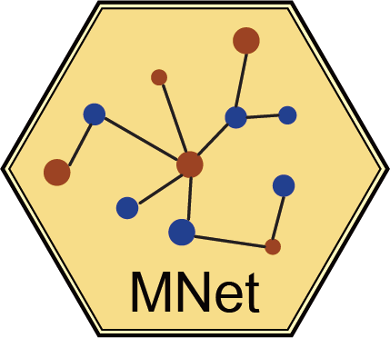
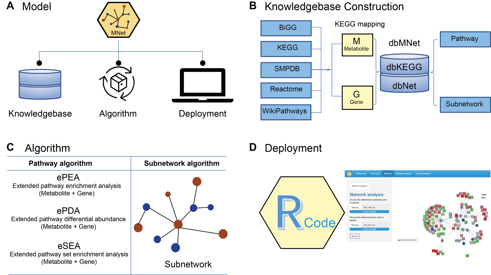

# MNet 

## 1. Overview

**MNet: an R package and Shiny app for integrative analysis of metabolomic and transcriptomic data**

- **Knowledgebase - dbMNet:** <font color="CadetBlue">**dbKEGG**</font> for extended pathway analysis and <font color="CadetBlue">**dbNet**</font> for metabolism-related subnetwork analysis  

- **Algorithm for extended pathway analysis:** Extended pathway enrichment analysis (<font color="CadetBlue">**ePEA**</font>), extended pathway differential abundance analysis (<font color="CadetBlue">**ePDA**</font>), and extended pathway set enrichment analysis (<font color="CadetBlue">**eSEA**</font>) to identify dysregulated metabolic pathways via considering both metabolites and genes  

- **Algorithm for metabolism-related subnetwork analysis:** Maximising the potential of our well-established <font color="CadetBlue">**dnet**</font> algorithm in integrative analysis of metabolomic and transcriptomic data to provide a systems-level understanding of metabolic interconnections



<font size="2" color="CadetBlue">**Figure 1. Overview of the analytical model underlying MNet.** **(A)** The MNet model includes three primary components: _**Knowledgebase**_, _**Algorithm**_, and _**Deployment**_. Their interconnected relationships are illustrated. **(B)** The _**Knowledgebase**_ component comprises gene-metabolite pairs sourced from five primary data sources. This comprehensive knowledgebase forms the foundation for both extended pathway and subnetwork analyses (see the next _**Algorithm**_ component). **(C)** The _**Algorithm**_ component includes methods for extended pathway and metabolism-related subnetwork analyses. Extended pathway analyses (implemented in ePEA, ePDA, and eSEA) consider both genes and metabolites, while metabolism-related subnetwork analysis employs our previously well-established algorithm ‘dnet’ to explore interactions involving genes and metabolites. **(D)** The _**Deployment**_ component includes its use via programmatically accessible R functions and an intuitive Shiny user interface.</font>

## 2. Get Started

Get started can be found [here](https://tuantuangui.github.io/MNet/articles/MNet.html)

### 2.1 R Installation

R (http://www.r-project.org) is a language and environment for statistical computing and graphics. We assume R (version 4.0.0 or higher) has been installed in your local machine. The latest version can be installed following instructions below for different platforms (Windows, Mac, and Linux).

- Quick link for Windows: [Download R for Windows](https://cran.r-project.org/bin/windows/base/).

- Quick link for Mac: [Download R for Mac OS X 11](https://cran.r-project.org/bin/macosx/big-sur-arm64/base/).

- Below are shell command lines in Terminal (for Linux):

```bash
#Ensure you have the conda:
conda install -c conda-forge r-base
```

### 2.2 MNet Installation

MNet requires R version 4.0.0 or higher, please see https://cran.r-project.org.

MNet is available for all operating systems and can be installed via the Github.

```R
if(!require(BiocManager)){
  install.packages("BiocManager")
}

if (!require(remotes)) {
  BiocManager::install("remotes", dependencies=T)
}

if (!require(devtools)) {
  BiocManager::install("devtools", dependencies=T)
}

BiocManager::install("hfang-bristol/dnet", dependencies=T)
BiocManager::install("tuantuangui/MNet", dependencies=T)

#If the installation of MNet is failed, please install the failed dependency package again, such as if the ERROR is "ERROR: dependencies ‘xxx’ is not available for package ‘MNet’", please install the 'xxx' package again.
```

Check the package 'MNet' successfully installed

```R
library(help=MNet)
```

### 2.3 Usage

- Extended pathway analysis can be found [here](https://tuantuangui.github.io/MNet/articles/01-Pathway_analysis.html)

- Metabolism-related subnetwork analysis can be found [here](https://tuantuangui.github.io/MNet/articles/02-Subnetwork_analysis.html)

- Routine analysis can be found [here](https://tuantuangui.github.io/MNet/articles/03-Routine_analysis.html)

## 3. Need help?

If you have any questions about MNet, please don’t hesitate to email me (guituant2009@163.com).

### 3.1 Frequently Asked Questions

1. Can not install dependent packages dnet  
If the ERROR is "Error: Failed to install 'dnet' from GitHub: Could not resolve host: api.github.com", please try it again.

```R
BiocManager::install("hfang-bristol/dnet", dependencies=T)
```
