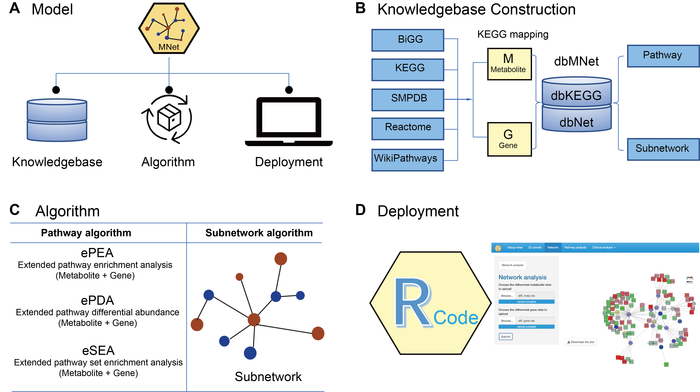

# MNet 

## Overview
**MNet: an R package and Shiny app for integrative analysis of metabolomic and transcriptomic data**

- **Knowledgebase - dbMNet:** **dbKEGG** for extended pathway analysis and **dbNet** for metabolism-related subnetwork analysis  
- **Algorithm for extended pathway analysis:** Extended pathway enrichment analysis (**ePEA**), extended pathway differential abundance analysis (**ePDA**), and extended pathway set enrichment analysis (**eSEA**) to identify dysregulated metabolic pathways via considering both metabolites and genes  
- **Algorithm for metabolism-related subnetwork analysis:** Maximising the potential of our well-established **dnet** algorithm in integrative analysis of metabolomic and transcriptomic data to provide a systems-level understanding of metabolic interconnections

**Figure 1. Overview of the analytical model underlying MNet.** **(A)** The MNet model includes three primary components: _**Knowledgebase**_, _**Algorithm**_, and _**Deployment**_. Their interconnected relationships are illustrated. **(B)** The _**Knowledgebase**_ component comprises gene-metabolite pairs sourced from five primary data sources. This comprehensive knowledgebase forms the foundation for both extended pathway and subnetwork analyses (see the next _**Algorithm**_ component). **(C)** The _**Algorithm**_ component includes methods for extended pathway and metabolism-related subnetwork analyses. Extended pathway analyses (implemented in ePEA, ePDA, and eSEA) consider both genes and metabolites, while metabolism-related subnetwork analysis employs our previously well-established algorithm ‘dnet’ to explore interactions involving genes and metabolites. **(D)** The _**Deployment**_ component includes its use via programmatically accessible R functions and an intuitive Shiny user interface.

## Get Started

Get started can be found [here](https://tuantuangui.github.io/MNet/articles/MNet.html)

## Need help?
If you have any questions about MNet, please don’t hesitate to email me (guituant2009@163.com).

