# <font size="5">Differential Information</font>
The case study by Liao et al. (2022) integrated metabolic and transcriptional analysis to reveal elevated pyrimidine metabolism and glutaminolysis in TNBC among 31 breast tumors, and classified them into two clusters. We utilize MNet to identify a set of features whose activities significantly differ between these two clusters. This result will hopefully hint at some specific biological activities that are pathologically altered in tumoral samples.

```{r,eval=FALSE}
library(MNet)
library(dplyr)
library(cowplot)
library(clusterProfiler)
library(org.Hs.eg.db)
library(pathview)
library(ggplot2)
library(tibble)

## meta_dat is the metabolic data of the 31 samples
## gene_dat is the transcriptional data of the 31 samples
## group is the group information of the 31 samples

## mlimma is the function of Differential Metabolite analysis by limma

diff_meta <- mlimma(meta_dat,group)
diff_gene <- mlimma(gene_dat,group)

```
# <font size="5">Pathway enrichment analysis</font>

Pathway enrichment analysis, includes gene pathway enrichment analysis only focusing on genes, metabolite pathway enrichment analysis only focusing on metabolites and extended pathway enrichment analysis focusing on both genes and metabolites, using function "PathwayAnalysis" in MNet.

## <font size="4">Extended pathway enrichment analysis (ePEA)</font>
Function 'PathwayAnalysis' with 'Extended' parameter, investigates metabolic pathway dysregulation considering both metabolites and genes, which we refer to as ePEA.

```{r,eval=FALSE}

## combine the metabolite information and gene information

all_dat <- rbind(diff_gene,diff_meta)

## filter the increase differential genes and metabolites
all_dat1 <- all_dat %>%
  filter(logFC>0.58) %>%
  filter(adj.P.Val < 0.05)

## the increase pathway analysis of both genes and metabolites
result1 <- PathwayAnalysis(all_dat1$name,out="Extended",p_cutoff=0.01)

## filter the decrease differential genes and metabolites
all_dat2 <- all_dat %>%
  filter(logFC < -0.58) %>%
  filter(adj.P.Val < 0.05)

## PathwayAnalysis performs pathway enrichment analysis of differential metabolites and differential expression genes, utilizing the Extended as a parameter
result2 <- PathwayAnalysis(all_dat2$name,out="Extended",p_cutoff=0.01)

p <- cowplot::plot_grid(plotlist = list(result1$p_barplot,result2$p_barplot))
result1$gp
result2$gp
```
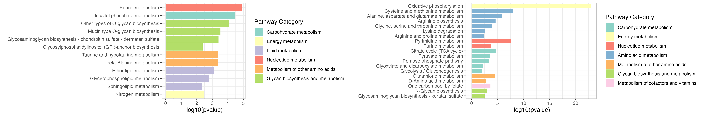
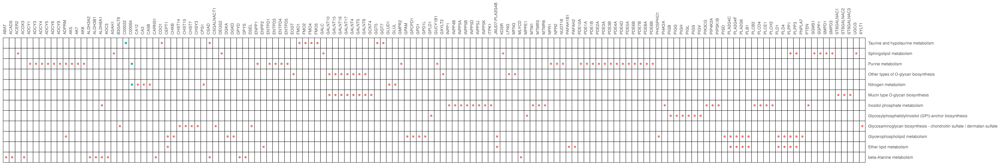
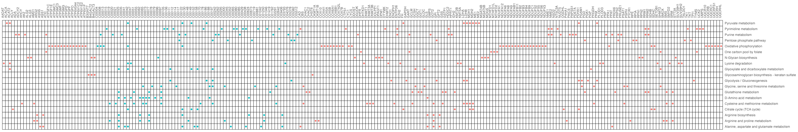

## <font size="4">Metabolite pathway enrichment analysis (mPEA)</font>
Function 'PathwayAnalysis' with 'metabolite' parameter, investigates metabolic pathway dysregulation considering only metabolites, which we refer to as mPEA.

```{r,eval=FALSE}

## filter the increase differential metabolites
diff_meta1 <- diff_meta %>%
  filter(logFC>0.58) %>%
  filter(adj.P.Val < 0.05)

## PathwayAnalysis performs pathway enrichment analysis of differential metabolites, utilizing 'metabolite' as a parameter
result1 <- PathwayAnalysis(diff_meta1$name,out="metabolite",p_cutoff=0.1)

## filter the decrease differential metabolites
diff_meta2 <- diff_meta %>%
  filter(logFC < -0.58) %>%
  filter(adj.P.Val < 0.05)

## PathwayAnalysis performs pathway enrichment analysis of differential metabolites, utilizing 'metabolite' as a parameter
result2 <- PathwayAnalysis(diff_meta2$name,out="metabolite",p_cutoff=0.1)

p <- cowplot::plot_grid(plotlist = list(result1$p_barplot,result2$p_barplot))
result1$gp
result2$gp
```


```{r,eval=T,echo=F, out.width="30%",fig.align="center",fig.cap=""}
library(knitr)
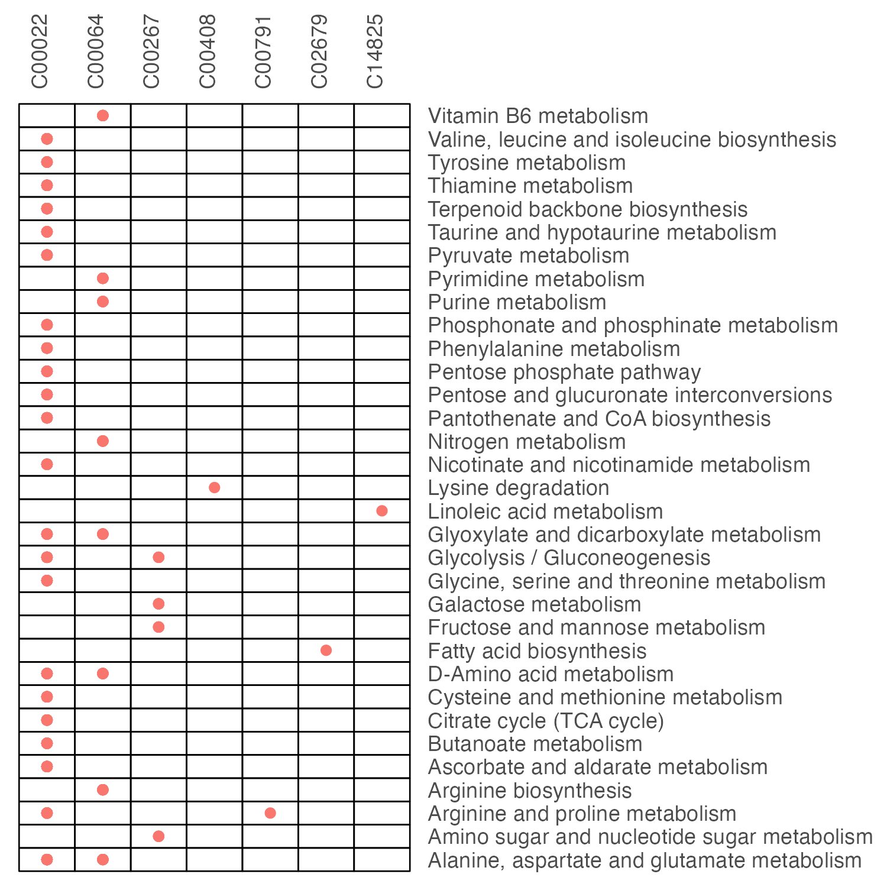
```

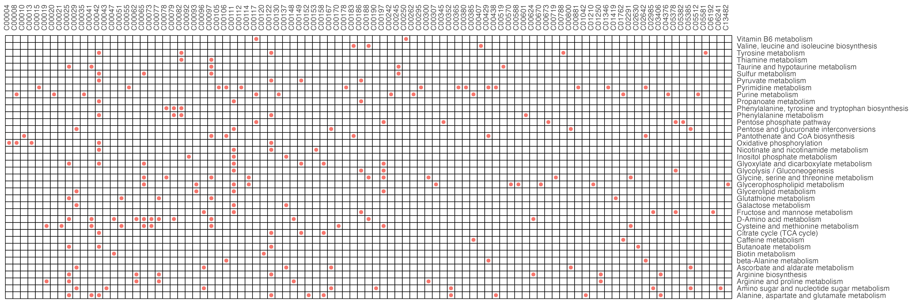

## <font size="4">Gene pathway enrichment analysis (gPEA)</font>
Function 'PathwayAnalysis' with 'gene' parameter, investigates metabolic pathway dysregulation considering only genes, which we refer to as gPEA.

```{r,eval=FALSE}

## filter the increase differential expression genes
diff_gene1 <- diff_gene %>%
  filter(logFC>0.58) %>%
  filter(adj.P.Val < 0.05)

## PathwayAnalysis performs pathway enrichment analysis of differential genes, utilizing 'gene' as a parameter
result1 <- PathwayAnalysis(diff_gene1$name,out="gene",p_cutoff=0.1)

## filter the decrease differential expression genes
diff_gene2 <- diff_gene %>%
  filter(logFC < -0.58) %>%
  filter(adj.P.Val < 0.05)

## PathwayAnalysis performs pathway enrichment analysis of differential genes, utilizing 'gene' as a parameter
result2 <- PathwayAnalysis(diff_gene2$name,out="gene",p_cutoff=0.1)

p <- cowplot::plot_grid(plotlist = list(result1$p_barplot,result2$p_barplot))
result1$gp
result2$gp
```

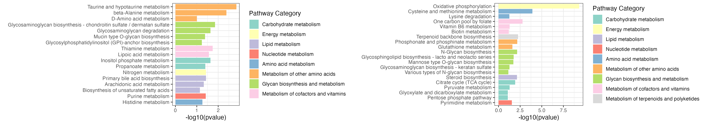
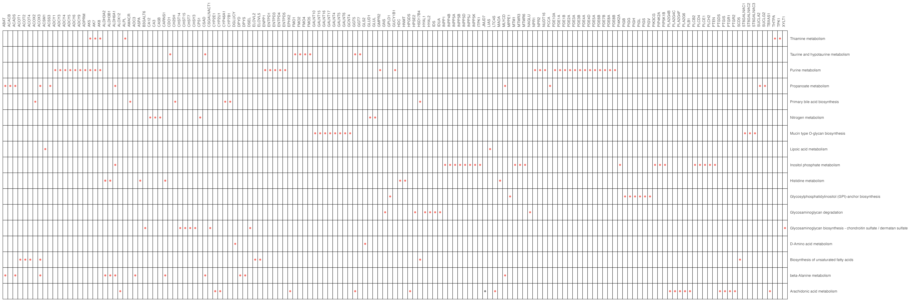


# <font size="5">Pathway differential abundance analysis</font>
Pathway differential abundance analysis, includes gene pathway differential abundance analysis only focusing on genes, metabolite pathway differential abundance analysis only focusing on metabolites and extended pathway differential abundance analysis focusing on both genes and metabolites, using function "DAscore" in MNet.

## <font size="4">Extended pathway differential abundance score (ePDA)</font>
Function 'DAscore' with 'Extended' parameter, investigates metabolic pathway dysregulation considering both metabolites and genes, which we refer to as ePDA (extended pathway differential abundance).


```{r,eval=FALSE}

## filter the differential expression genes

diff_gene_increase <-  diff_gene %>%
  filter(logFC>0.58) %>%
  filter(adj.P.Val < 0.05)
diff_gene_decrease <- diff_gene %>%
  filter(logFC < -0.58) %>%
  filter(adj.P.Val < 0.05)

## filter the differential metabolites

diff_meta_increase <- diff_meta %>%
  filter(logFC>0.58) %>%
  filter(adj.P.Val < 0.05)

diff_meta_decrease <- diff_meta %>%
  filter(logFC < -0.58) %>%
  filter(adj.P.Val < 0.05)

## the extended pathway differential abundance analysis
 ExtendDAscore_result <- DAscore(c(diff_gene_increase$name,diff_meta_increase$name),c(diff_gene_decrease$name,diff_meta_decrease$name),c(diff_gene$name,diff_meta$name),min_measured_num = 2,out="Extended")

```
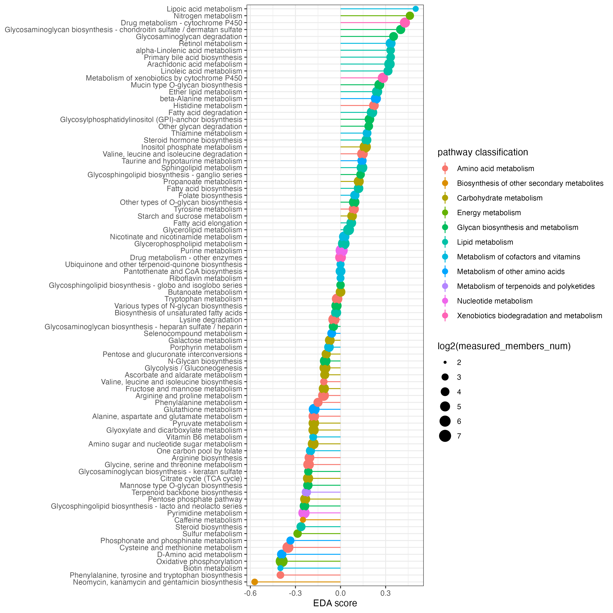{width=50%}

## <font size="4">Metabolite pathway differential abundance score (mPDA)</font>
Function 'DAscore' with 'metabolite' parameter, investigates metabolic pathway dysregulation considering only metabolites, which we refer to as mPDA (metabolite pathway differential abundance).

```{r,eval=FALSE}
## filter the differential metabolites

diff_meta_increase <- diff_meta %>%
  filter(logFC > 0.58) %>%
  filter(adj.P.Val < 0.05)

diff_meta_decrease <- diff_meta %>%
  filter(logFC < -0.58) %>%
  filter(adj.P.Val < 0.05)

## the metabolite pathway differential abundance analysis
dascore_result_meta <- DAscore(diff_meta_increase$name,diff_meta_decrease$name,diff_meta$name,out="metabolite")

```

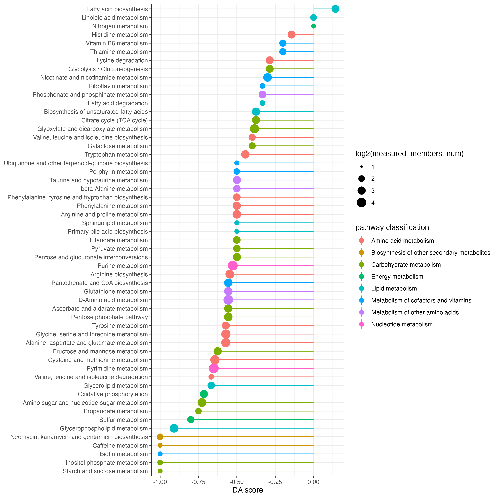{width=50%}

## <font size="4">Gene pathway differential abundance score (gPDA)</font>
Function 'DAscore' with 'gene' parameter, investigates metabolic pathway dysregulation considering only genes, which we refer to as gPDA (gene pathway differential abundance).

```{r,eval=FALSE}
## filter the differential genes

diff_gene_increase <- diff_gene %>%
  filter(logFC > 0.58) %>%
  filter(adj.P.Val < 0.05)

diff_gene_decrease <- diff_gene %>%
  filter(logFC < -0.58) %>%
  filter(adj.P.Val < 0.05)

## the gene pathway differential abundance analysis
dascore_result_gene <- DAscore(diff_gene_increase$name,diff_gene_decrease$name,diff_gene$name,out="gene")

```

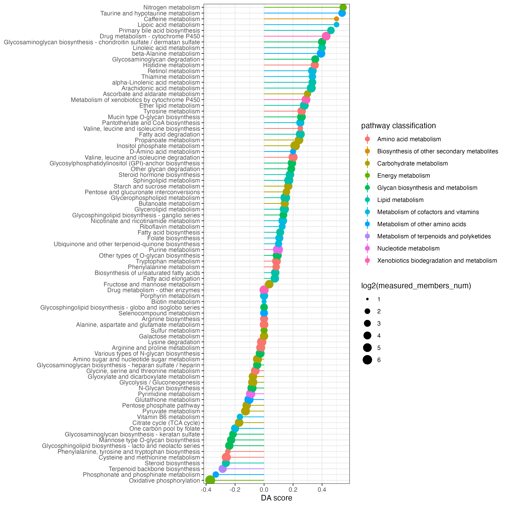{width=50%}

# <font size="5">Pathway set enrichment analysis</font>
Pathway set enrichment analysis, includes gene set enrichment analysis only focusing on genes, metabolite set enrichment analysis only focusing on metabolites and extended pathway set enrichment analysis focusing on both genes and metabolites, using function "ESEA" in MNet.

## <font size="4">Extended pathway set enrichment analysis (eSEA)</font>

Extended pathway set enrichment analysis which includes genes and metabolites

```{r,eval=FALSE}
## the data is from R package 'clusterProfiler'
## transform the gene's entrezid to symbol
gene_symbol <- clusterProfiler::bitr(rownames(gse16873.d),fromType ="ENTREZID",toType="SYMBOL",OrgDb = org.Hs.eg.db)

dat <- gse16873.d %>%
  as.data.frame() %>%
  rownames_to_column(var="ENTREZID") %>%
  inner_join(gene_symbol,by="ENTREZID")
gene.data <- dat$DCIS_1
names(gene.data) <- dat$SYMBOL

dat <- c(sim.cpd.data,gene.data)

## the Extended pathway set enrichment analysis
result <- ESEA(dat,out="Extended")
result$leadingEdge <- as.character(result$leadingEdge)
```

eSEA plot of interested pathway which includes genes and metabolites
```{r,eval=FALSE}
## The plot of Butanoate metabolism contains genes and metabolites
p <- pESEA("Butanoate metabolism",dat,out="Extended")
```

```{r,eval=T,echo=F, out.width="60%",fig.align="center",fig.cap="The eSEA plot of Butanoate metabolism"}
library(knitr)
knitr::include_graphics("result_v0131/ESEA_Butanoate_extended.png")
```

## <font size="4">Metabolite set enrichment analysis (mSEA)</font>
Metabolite set enrichment analysis which only includes metabolites

```{r,eval=FALSE}
## the metabolite pathway set enrichment analysis
result <- ESEA(sim.cpd.data,out="metabolite")
result$leadingEdge <- as.character(result$leadingEdge)
```

mSEA plot of interested pathway which only includes metabolites
```{r,eval=FALSE}
## The plot of Butanoate metabolism contains metabolites
p <- pESEA("Butanoate metabolism",sim.cpd.data,out="metabolite")
```

```{r,eval=T,echo=F, out.width="60%",fig.align="center",fig.cap="The mSEA plot of Butanoate metabolism"}
library(knitr)
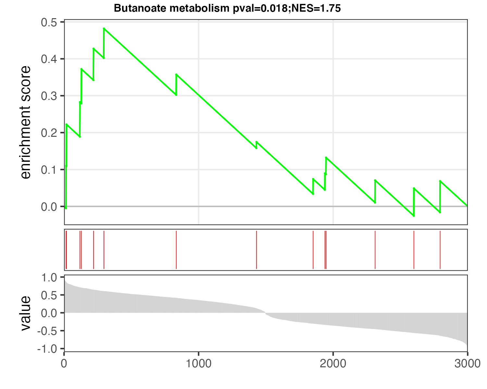
```

## <font size="4">Gene set enrichment analysis (gSEA)</font>
Gene set enrichment analysis which only includes genes

```{r,eval=FALSE}
## the gene pathway set enrichment analysis
result <- ESEA(gene.data,out="gene")
result$leadingEdge <- as.character(result$leadingEdge)
```

gSEA plot of interested pathway which includes genes
```{r,eval=FALSE}
## The plot of Butanoate metabolism contains genes
p <- pESEA("Butanoate metabolism",gene.data,out="gene")
```

```{r,eval=T,echo=F, out.width="60%",fig.align="center",fig.cap="The gSEA plot of Butanoate metabolism"}
library(knitr)
#knitr::include_graphics("./results/PRO/ropls/3.vip_plot.png")
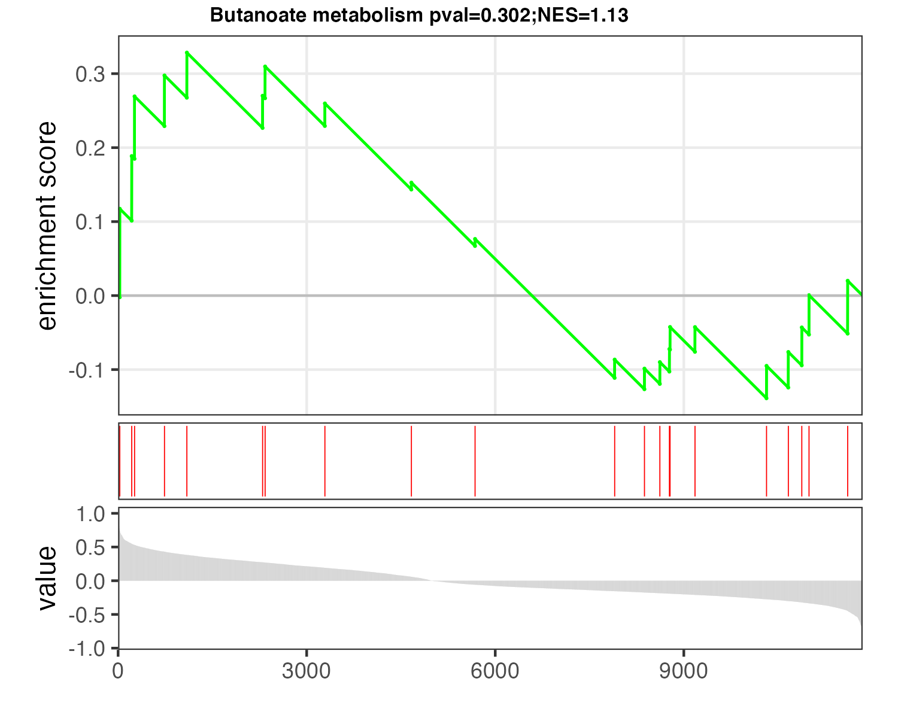
```

