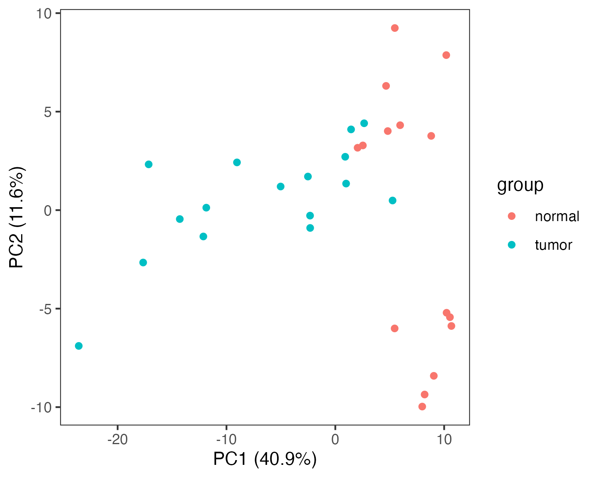
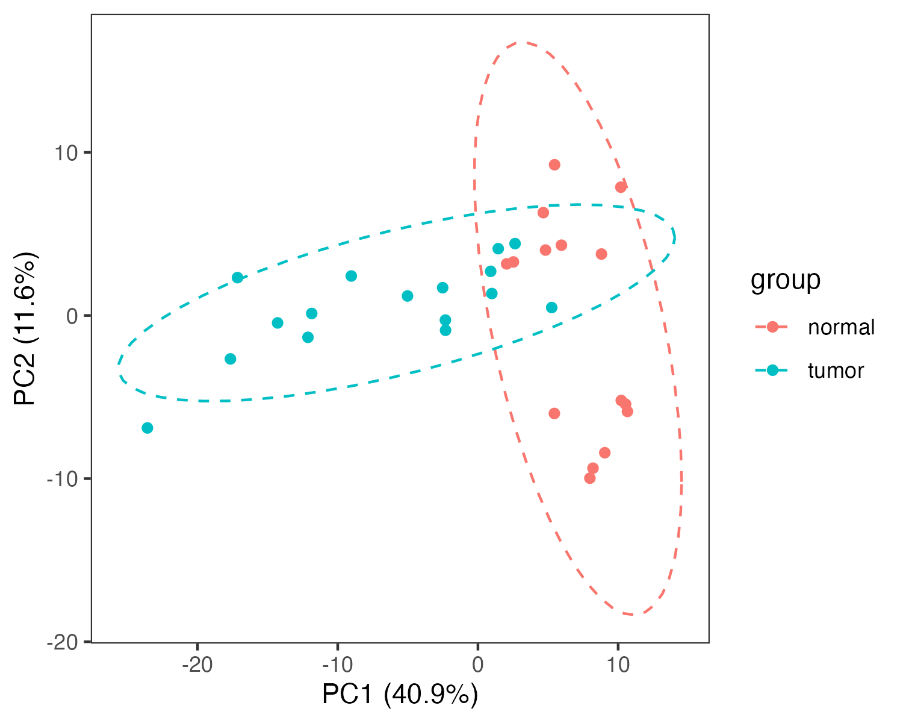
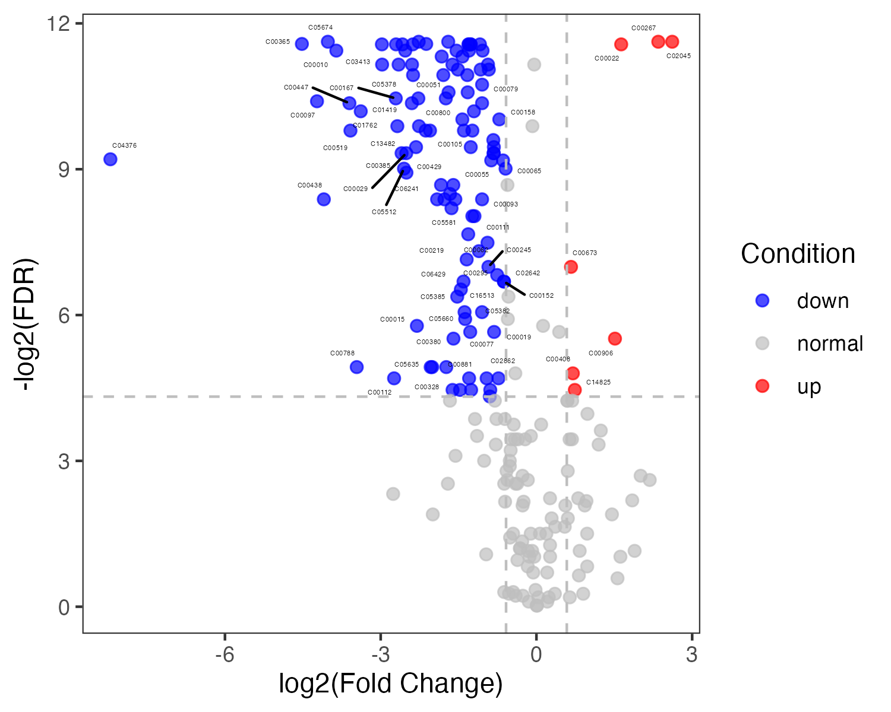
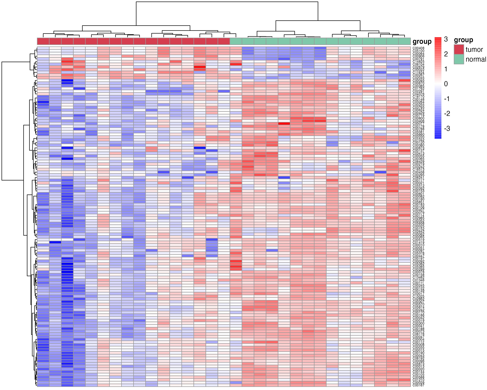
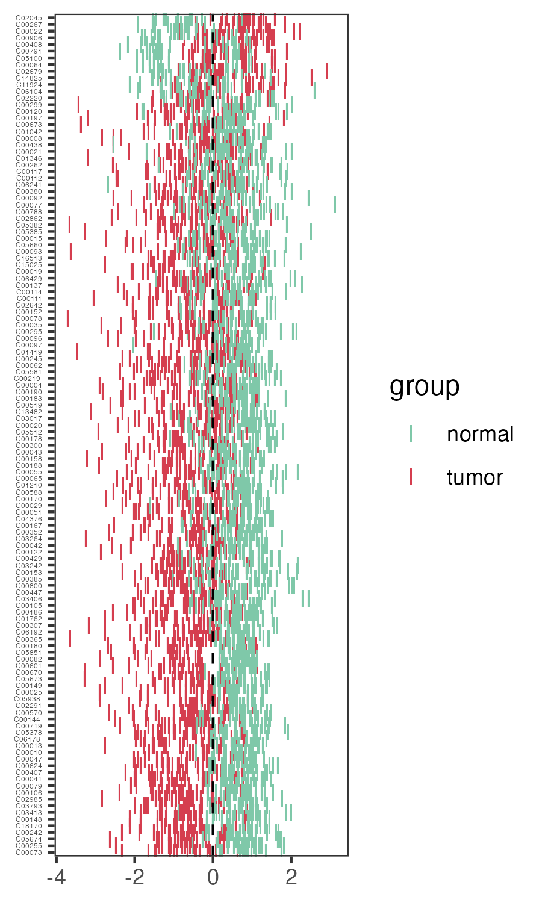
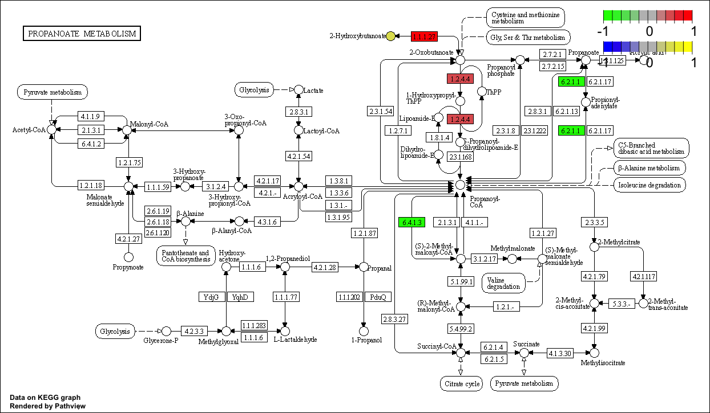
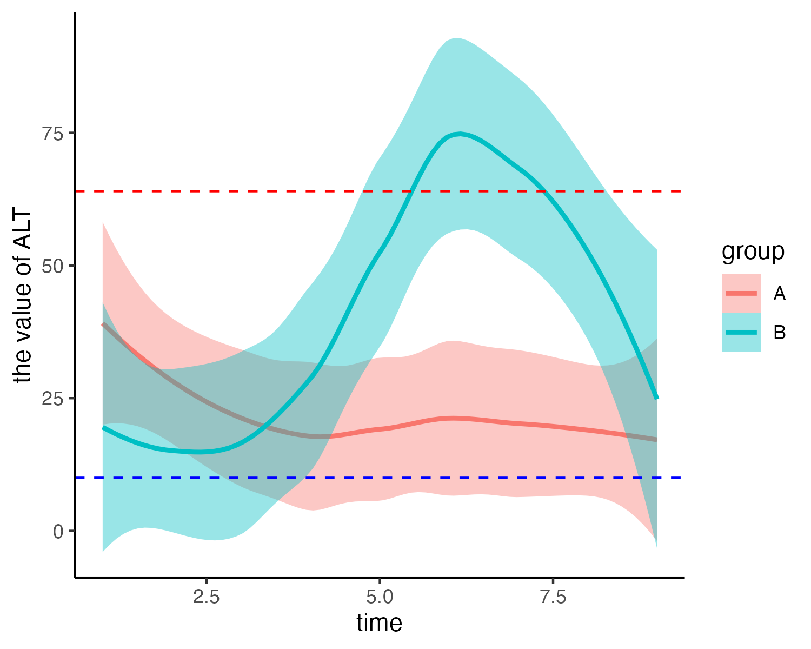
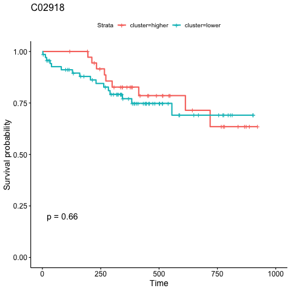

# <font size="5">Metabolite compound name transformation</font>

## <font size="4">Metabolite compound name transform to RefMet name</font>

<font color="CadetBlue">**This step requires networking**</font>

**RefMet: A Reference list of Metabolite names.**The main objective of RefMet is to provide a standardized reference nomenclature for both discrete metabolite structures and metabolite species identified by spectroscopic techniques in metabolomics experiments.

```{r,eval=FALSE}
library(MNet)
library(dplyr)
library(tibble)
library(survival)
library(tidyr)

compound_name <- c("2-Hydroxybutyric acid","1-Methyladenosine","tt","2-Aminooctanoic acid")
## transform the compound name to refmet name
refmetid_result <- name2refmet(compound_name)
```

```{r,eval=TRUE,echo=FALSE,message=FALSE}
library(dplyr)
refmetid_result <- data.table::fread("result_v0131/refmetid_result.txt") %>%
  as.data.frame()
refmetid_result
```

## <font size="4">Metabolite compound name transform to KEGG ID</font>

<font color="CadetBlue">**This step requires networking**</font>

Transform the metabolites compound name to KEGG ID

```{r,eval=FALSE}
compound_name <- c("2-Hydroxybutyric acid","1-Methyladenosine","tt","2-Aminooctanoic acid")
## transform the compound name to KEGG ID, some metabolites have several KEGG ID
keggid_result <- name2keggid(compound_name) %>%
  separate_rows(KEGG_id,sep=";")
```

```{r,eval=TRUE,echo=FALSE,message=FALSE}
library(dplyr)
keggid_result <- data.table::fread("result_v0131/keggid_result.txt") %>%
  as.data.frame()
keggid_result
```

## <font size="4">Metabolite name corresponding to kegg pathway</font>

<font color="CadetBlue">**This step requires networking**</font>

Search the kegg pathway corresponding to the metabolite name

```{r,eval=FALSE}
compound_name <- c("2-Hydroxybutyric acid","1-Methyladenosine","tt","2-Aminooctanoic acid")
## Search the kegg pathway corresponding to the metabolite name
result_all <- name2pathway(compound_name)

##### Output is the each metabolite related pathway
result_name2pathway <- result_all$name2pathway

## the KEGG ID of the metabolite name
result_name2keggid <- result_all$kegg_id

## the pathway of the metabolite name
result_name2enrichpathway <- result_all$pathway
```

```{r,eval=TRUE,echo=FALSE,message=FALSE}
library(dplyr)
df <- data.table::fread("result_v0131/name2pathway_keggpathway.txt") %>%
  as.data.frame()
df
```

```{r,eval=TRUE,echo=FALSE,message=FALSE}
library(dplyr)
df <- data.table::fread("result_v0131/name2pathway_keggid.txt") %>%
  as.data.frame()
df
```
```{r,eval=TRUE,echo=FALSE,message=FALSE}
library(dplyr)
df <- data.table::fread("result_v0131/name2pathway_pathwayenrich.txt") %>%
  as.data.frame()
df
```

## <font size="4">Metabolite KEGG ID transform to KEGG pathway</font>

KEGG ID transform to KEGG pathway

```{r,eval=TRUE,message=FALSE}
library(MNet)
keggid <- c("C05984","C02494")
##### the output is the each metabolite related pathway
keggpathway_result <- keggid2pathway(keggid)
head(keggpathway_result)
```

## Pathway information
Get the gene and the metabolite in the pathway

```{r,eval=TRUE,message=FALSE}
library(MNet)
## the genes and metabolites in pathway 'hsa00630'
result <- pathwayinfo("hsa00630")

## the genes and metabolites in pathway 'Glyoxylate and dicarboxylate metabolism'
result <- pathwayinfo("Glyoxylate and dicarboxylate metabolism")
result$gene_info[1:2,]
result$compound_info[1:2,]
```

## <font size="4">Pathway name transform to pathway id</font>
Transform the KEGG pathway name to KEGG pathway ID

```{r,eval=TRUE,message=FALSE}
library(MNet)
## the KEGG pathway ID of pathway name
pathwayid <- pathway2pathwayid("Glycolysis / Gluconeogenesis")
pathwayid
```

# <font size="5">Group-wise analyses</font>
## <font size="4">PCA plot</font>

PCA of the data

```{r,eval=FALSE}
### the pca plot
p_PCA <- pPCA(meta_dat,group)
```

{width=30%} 
{width=30%}
{width=30%}


## <font size="4">Differnetial metabolite analysis</font>

### <font size="3">Function 'mlimma'</font>
```{r,eval=FALSE}

## mlimma is the function of Differential Metabolite analysis by limma
diff_result <- mlimma(meta_dat,group)

```

### <font size="3">Function 'DM'</font>

```{r,eval=FALSE}
## DM is the function of Differential Metabolite analysis by OPLS-DA
diff_result <- DM(2**meta_dat,group)

## filter the differential metabolites by default fold change >1.3 or < 1/1.3 ,fdr < 0.05 and VIP>0.8

diff_result_filter <- diff_result %>%
  filter(Fold_change >1.3 | Fold_change < 1/1.3) %>%
  filter(Padj_wilcox < 0.1) %>%
  filter(VIP>0.8)

```

```{r,echo=FALSE,eval=FALSE}
library(dplyr)
out_dir="result"
df <- data.table::fread(paste0("result","/2.diff_TumorvsNormal.txt")) %>%
  as.data.frame()
df %>% DT::datatable(options=list(pageLength=5,searchHighlight=T,buttons=c('csv','copy'), dom='Bt',scrollX=T,fixedColumns=list(leftColumns=1)), style='default', caption="", rownames=FALSE, escape=F, extensions=c('Buttons','FixedColumns'))
```


## <font size="4">Differential metabolites' volcano</font>

Volcano plot of metabolites using the function "pVolcano"

```{r,eval=FALSE}
p_volcano <- pVolcano(diff_result,foldchange_threshold=1.5)

```
{width=50%}

## <font size="4">Differential metabolites' heatmap</font>

Heatmap plot of differentital metabolites using the function "pHeatmap"

```{r,eval=FALSE}
meta_dat_diff <- meta_dat[rownames(meta_dat) %in% diff_result_filter$Name,]
p_heatmap <- pHeatmap(meta_dat_diff,group,fontsize_row=5,fontsize_col=4,clustering_method="ward.D",clustering_distance_cols="correlation")

```
{width=50%}

## <font size="4">Differential metabolites' zscore</font>

Zscore plot of differentital metabolites using the function "pZscore"

```{r,eval=FALSE}
p_zscore <- pZscore(meta_dat_diff,group,ysize=3)
#p_zscore

```
{width=30%}


# <font size="5">Feature selection</font>

## <font size="4">Boruta</font>
Using machine learning "Boruta" for feature selection 

```{r,eval=FALSE}
#group <- rep("normal",length(names(meta_dat)))
#group[grep("TUMOR",names(meta_dat))] <- "tumor"
meta_dat1 <- t(meta_dat) %>%
  as.data.frame() %>%
  mutate(group=group)

result_ML_Boruta <- ML_Boruta(meta_dat1)
```

## <font size="4">Random Forest</font>
Using machine learning "Random Forest" for feature selection

```{r,eval=FALSE}
result_ML_RF <- ML_RF(meta_dat1)
result_ML_RF$p
result_ML_RF$feature_result
```

## <font size="4">XGBoost</font>
Using machine learning "  XGBoost" for feature selection

```{r,eval=FALSE}
result_ML_xgboost <- ML_xgboost(meta_dat1)
result_ML_xgboost$p
result_ML_xgboost$feature_result
```

## <font size="4">LASSO</font>
Using machine learning "LASSO" for feature selection

```{r,eval=FALSE}
result_ML_lasso <- ML_alpha(meta_dat1,method="lasso")

```

## <font size="4">elastic network</font>
Using machine learning "elastic network" for feature selection

```{r,eval=FALSE}
result_ML_elastic <- ML_alpha(meta_dat1,method="elastic")
```
# <font size="5">Pathway analysis</font>

## <font size="4">Pathview only metabolites</font>

```{r,eval=FALSE}
kegg_id <- c("C02494","C03665","C01546","C05984","C14088","C00587")
value <- c(-0.3824620,0.1823628,-1.1681486,0.5164899,1.6449798,-0.7340652)
names(value) <- kegg_id
cpd.data <- value

gene_name <- c("LDHA","BCKDHB","PCCA","ACSS1")
gene_value <- c(1,0.5,-1,-1)
names(gene_value) <- gene_name

## pathview plot of metabolites
pPathview(cpd.data,outdir="result_v0131")
```
{width=70%}

## <font size="4">Pathview contains metabolites and genes</font>

```{r,eval=FALSE}
## pathview plot of genes and metabolites
pPathview(cpd.data=cpd.data,gene.data=gene_value,outdir="result_v0131")
```
{width=70%}

# <font size="5">Clinical analysis</font>
## <font size="4">Time series of clinical</font>
Column contains the time, group, clinical index(such as ALT), low and high
```{r,eval=FALSE}
clinical_index[1:5,]
time_series_ALT <- pCliTS(clinical_index,"ALT")
```
{width=50%}

## <font size="4">Survival analysis</font>
```{r,eval=FALSE}
names(aml)[3] ="group"
p=survCli(aml)
p
```
{width=50%}

## <font size="4">Metabolites’ survival plot</font>

```{r,eval=FALSE}
metabolites <- c("C03819","C02918","C03916")
survMet(dat_surv,metabolites,cluster_method="mean",out_dir="result_v0131/survival/")
```
{width=50%}

## <font size="4">Cox analysis</font>

```{r,eval=FALSE}
result <- MetCox(dat_surv)
```

```{r,eval=TRUE,echo=FALSE,results='hide',message=FALSE,warning=FALSE}
library(dplyr)
library(MNet)
library(stringr)
library(ggplot2)
library(RColorBrewer)
library(clusterProfiler)
library(org.Hs.eg.db)
library(pathview)
library(tibble)
library(survival)
```

# <font size="5">Session information</font>

```{r,eval=TRUE}
sessionInfo()
```
